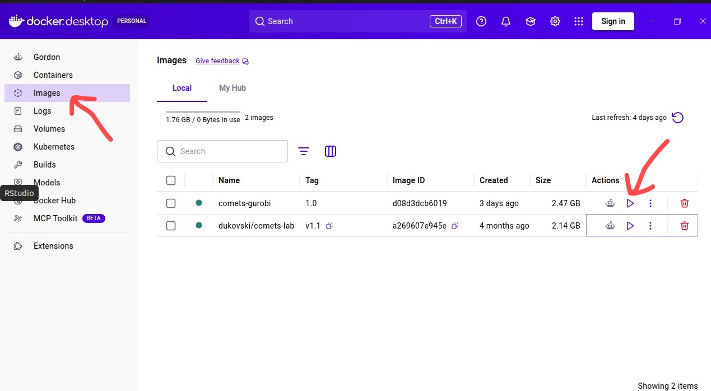
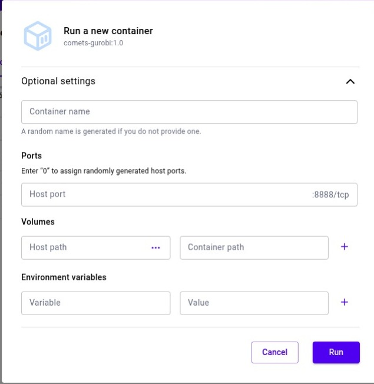

 **Requisitos previos**

 
## 1. Contenedos COMETS-GUROBI
Crear una carpeta y dentro un archivo llamado `Dockerfile` (sin extensión):

```{}
mkdir ~/comets_imagen
nano ~/comets_imagen/Dockerfile #LINUS MAC 
ni ~/comets_imagen/Dockerfile #version WINDOWS
``` 

 Contenido del Dockerfile:
```{}
FROM dukovski/comets-lab:v1.1

RUN apt-get update && apt-get install -y curl && rm -rf /var/lib/apt/lists/*

RUN curl -O https://packages.gurobi.com/10.0/gurobi10.0.3_linux64.tar.gz && \
    tar -xzf gurobi10.0.3_linux64.tar.gz -C /opt/ && \
    rm gurobi10.0.3_linux64.tar.gz

ENV GUROBI_COMETS_HOME=/opt/gurobi1003/linux64
ENV GRB_LICENSE_FILE=/root/gurobi.lic
ENV LD_LIBRARY_PATH=/opt/gurobi1003/linux64/lib
```

## 2. Crear la imagen 
```{}
docker build -t comets-gurobi:1.0 ~/comets_imagen/

#mac

docker build --platform linux/amd64 -t comets-gurobi:1.0 ~/comets_imagen/
```

**comets-gurobi es el nombre de la imagen**

Al terminar aparece en Docker Desktop en la parte de **Images**.

## 3. Correr el contenedor desde Docker Desktop
En Docker Desktop:

1. Ir a **Images**.
2. Seleccionar la imagen `comets-gurobi:1.0`.
3. Hacer clic en **Run**.
4. En **Optional settings**, configurar los parámetros necesarios:



Después tendrás que agregar especificaciones para crear tu contenedor 


| Campo | Valor |
|---|---|
| Container name | `comets-gurobi` |
| Host port | `8888` |
| Host path | `/ruta/carpeta/que/quieres/montar` |
| Container path | `/home/ruta/docker/` |

## Paso 4. Licencia Gurobi 

    i. Web License Service de Gurobi [sitio web](https://www.gurobi.com/academics)
 
    ii: Descargar 
    
    iii. Migrar a Docker
    cp /home/abigaylmontantearenas/Downloads/gurobi.lic comets-gurobi:1.0:/root/gurobi.lic


#### 1. Crecimiento aislado 
   i. Simular el crecimiento de **Varivorax paradoxus** 
```{}
import os
os.environ['GUROBI_COMETS_HOME'] = '/opt/gurobi1003/linux64'
os.environ['GRB_LICENSE_FILE'] = '/root/gurobi.lic'
os.environ['LD_LIBRARY_PATH'] = '/opt/gurobi1003/linux64/lib'

%cd /home/comets/notebooks

!python3 ModelajeMetabolico/scr/sim_syncom_comets.py \
  --gem_path ModelajeMetabolico/modelos \
  --strains Rerythropolis \
  --media lb \
  --cycles 1000 \
  --threads 1 \
  --outdir ./Rerythropolis
```

    ii. Graficar su biomasa en el tiempo
```{python}
# Cargar paquetes para graficar 
import pandas as pd
import matplotlib.pyplot as plt
# Cargar archivo de biomasa
biomasa = pd.read_csv('/home/comets/notebooks/Rerythropolis/total_biomass.txt', sep='\t')
# Renombrar columnas
biomasa.columns = ['ciclo', 'biomasa']

# Graficar
plt.figure(figsize=(8, 5))
plt.plot(biomasa['ciclo'], biomasa['biomasa'], color='steelblue', linewidth=2)
plt.xlabel('Ciclos', fontsize=13)
plt.ylabel('Biomasa (g DW)', fontsize=13)
plt.title('Curva de crecimiento Rhodoccoccus erythropolis', fontsize=14)
plt.grid(True, alpha=0.3)
plt.tight_layout()
plt.show()
```


      iii. Filtrar los metabolitos que están cambiando 
      iv.  Graficar el perfil metabólico

    
    ```{python}
import pandas as pd
import matplotlib.pyplot as plt

# Cargar datos
flujos = "/home/comets/notebooks/Rerythropolis/Rerythropolis_exchange_fluxes.tsv"

# Data frame flujos 
df_flujos = pd.read_csv(
    flujos,
    sep="\t"
)

# Revisar columnas
print(df_flujos.columns)

# Separar cycle
cycle = df_flujos["cycle"]

# Quedarse solo con columnas numéricas
df_flux = df_flujos.drop(columns=["cycle"]) #remueve columna ''cycle''
df_flux = df_flux.apply(pd.to_numeric, errors="coerce") #se asegura de que todos los datos sean numéricos 

# Calcular tasas de cambio (valor actual−valor previo)
# diff compara cada ciclo con el inmediatamente anterior
# El primer valor queda NaN porque no existe una fila anterior para restar.
df_tasas = df_flux.diff().fillna(0)


# Encontrar qué metabolitos cambiaron al menos una vez durante la simulación
metabolitos = (
    df_tasas.columns[
        (df_tasas != 0).any()
    ].tolist()
)

print(f"{len(metabolitos)} metabolitos.")

# Graficar
if metabolitos:

    plt.figure(figsize=(12, 6))

    for metabolito in metabolitos:

        plt.plot(
            cycle,
            df_tasas[metabolito],
            linewidth=1,
            label=metabolito
        )

    plt.yscale("symlog", linthresh=1e-9)

    plt.title("Tasas de Cambio Metabólico", fontweight="bold")
    plt.xlabel("Ciclo")
    plt.ylabel("ΔFlux")

    plt.axhline(
        0,
        linestyle="--",
        alpha=0.5
    )

    plt.legend(
        bbox_to_anchor=(1.02, 1),
        loc="upper left",
        fontsize=7
    )

  
    plt.show()

    ```


    v. Graficar un metabolito que sea de tu interés
    
    ```{python}
import matplotlib.pyplot as plt
import pandas as pd

# Seleccionar metabolito
metabolito_seleccionado = "EX_cl_e"

# Definir ciclo máximo a graficar
ciclo_corte = 1000

# Filtrar ciclos
df_flujos_filt = df_flujos[
    df_flujos["cycle"] <= ciclo_corte
]

# Revisar si el metabolito existe
if metabolito_seleccionado not in df_flujos_filt.columns:
    print(f"Error: {metabolito_seleccionado} no existe.")

else:
    plt.figure(figsize=(8, 5))

    plt.plot(
        df_flujos_filt["cycle"],
        df_flujos_filt[metabolito_seleccionado],
        linewidth=2.5
    )

    plt.title(
        f"Flujo de {metabolito_seleccionado}",
        fontweight="bold"
    )

    plt.xlabel("Ciclo")
    plt.ylabel("Flux")

    plt.tight_layout()
    plt.show()

    ```


      
#### 2. Medio de cultivo 
 i. Simular el crecimiento de **Varivorax paradoxus**  en otro medio de cultivo
 revisar la función para ver que otros medios hay 
```{}
python3 ModelajeMetabolico/scr/sim_syncom_comets.py --help
```

    ```{python}
# Cargar paquetes
import pandas as pd
import matplotlib.pyplot as plt

# Cargar archivo de biomasa LB
biomasa_lb = (
    "/home/comets/notebooks/"
    "ModelajeMetabolico/simulaciones_output/"
    "Rerythropolis_lb/biomass.txt"
)

df_lb = pd.read_csv(
    biomasa_lb,
    sep=r"\s+",
    header=None
)

# Renombrar columnas
df_lb.columns = [
    "ciclo",
    "col2",
    "col3",
    "modelo",
    "biomasa"
]


# Cargar archivo de biomasa Marine
biomasa_marine = (
    "/home/comets/notebooks/"
    "ModelajeMetabolico/simulaciones_output/"
    "Rerythropolis_marine/biomass.txt"
)

df_marine = pd.read_csv(
    biomasa_marine,
    sep=r"\s+",
    header=None
)

# Renombrar columnas
df_marine.columns = [
    "ciclo",
    "col2",
    "col3",
    "modelo",
    "biomasa"
]


# Graficar Marine
plt.figure(figsize=(8, 5))

plt.plot(
    df_marine["ciclo"],
    df_marine["biomasa"],
    linewidth=2.5
)

plt.title(
    "Biomasa: Condición Marine",
    fontweight="bold"
)

plt.xlabel("Ciclo")
plt.ylabel("Biomasa (gDW)")

plt.tight_layout()
plt.show()


# Comparación de crecimiento
ciclo_corte = min(
    df_lb["ciclo"].max(),
    df_marine["ciclo"].max()
)

# Filtrar al mismo número de ciclos
df_lb_filt = df_lb[
    df_lb["ciclo"] <= ciclo_corte
]

df_marine_filt = df_marine[
    df_marine["ciclo"] <= ciclo_corte
]


# Graficar comparación
plt.figure(figsize=(9, 5))

plt.plot(
    df_lb_filt["ciclo"],
    df_lb_filt["biomasa"],
    linewidth=2.5,
    label="LB"
)

plt.plot(
    df_marine_filt["ciclo"],
    df_marine_filt["biomasa"],
    linewidth=2.5,
    label="Marine"
)

plt.title(
    "Comparación de Crecimiento",
    fontweight="bold"
)

plt.xlabel("Ciclo")
plt.ylabel("Biomasa (gDW)")

plt.legend(
    title="Medio de cultivo"
)

plt.tight_layout()
plt.show()

    ```
  

    iii. Graficar su consumo y secreción de metabolitos COMPARACION metabolitos
```{python}
import pandas as pd
import matplotlib.pyplot as plt

# Cargar datos LB
flujos_lb = ("/home/comets/notebooks/ModelajeMetabolico/simulaciones_output/Rerythropolis_lb/Rerythropolis_lb_exchange_fluxes.tsv"
            )

df_flujos_lb = pd.read_csv(
    flujos_lb,
    sep="\t"
)

# Cargar datos Marine
flujos_marine = (
    "/home/comets/notebooks/ModelajeMetabolico/simulaciones_output/Rerythropolis_marine/Rerythropolis_marine_exchanges_fluxes.tsv"
)

df_flujos_marine = pd.read_csv(
    flujos_marine,
    sep="\t"
)


# Seleccionar metabolito
metabolito_seleccionado = "EX_cl_e"

# Definir ciclo máximo
ciclo_corte = 1000


# Filtrar ciclos
df_lb_filt = df_flujos_lb[
    df_flujos_lb["cycle"] <= ciclo_corte
]

df_marine_filt = df_flujos_marine[
    df_flujos_marine["cycle"] <= ciclo_corte
]


# Separar cycle
cycle_lb = df_lb_filt["cycle"]
cycle_marine = df_marine_filt["cycle"]


# Calcular tasas de cambio
df_tasas_lb = (
    df_flux_lb.diff().fillna(0)
)

df_tasas_marine = (
    df_flux_marine.diff().fillna(0)
)


# Revisar si el metabolito existe
if (
    metabolito_seleccionado
    not in df_tasas_lb.columns
    or
    metabolito_seleccionado
    not in df_tasas_marine.columns
):
    print(
        f"Error: {metabolito_seleccionado} no existe."
    )

else:

    plt.figure(figsize=(9, 5))

    # LB
    plt.plot(
        cycle_lb,
        df_tasas_lb[
            metabolito_seleccionado
        ],
        linewidth=2.5,
        label="LB"
    )

    # Marine
    plt.plot(
        cycle_marine,
        df_tasas_marine[
            metabolito_seleccionado
        ],
        linewidth=2.5,
        label="Marine"
    )

    plt.yscale(
        "symlog",
        linthresh=1e-9
    )

    plt.axhline(
        0,
        linestyle="--",
        alpha=0.5
    )

    plt.title(
        f"Tasa de cambio de "
        f"{metabolito_seleccionado}",
        fontweight="bold"
    )

    plt.xlabel("Ciclo")
    plt.ylabel("ΔFlux")

    plt.legend(
        title="Medio de cultivo"
    )

    plt.tight_layout()
    plt.show()
```


### instala git para clonar repos 
```{}
apt-get update && apt-get install -y git
git --version
```